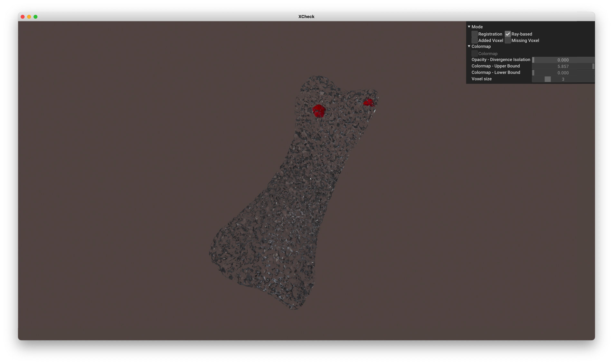
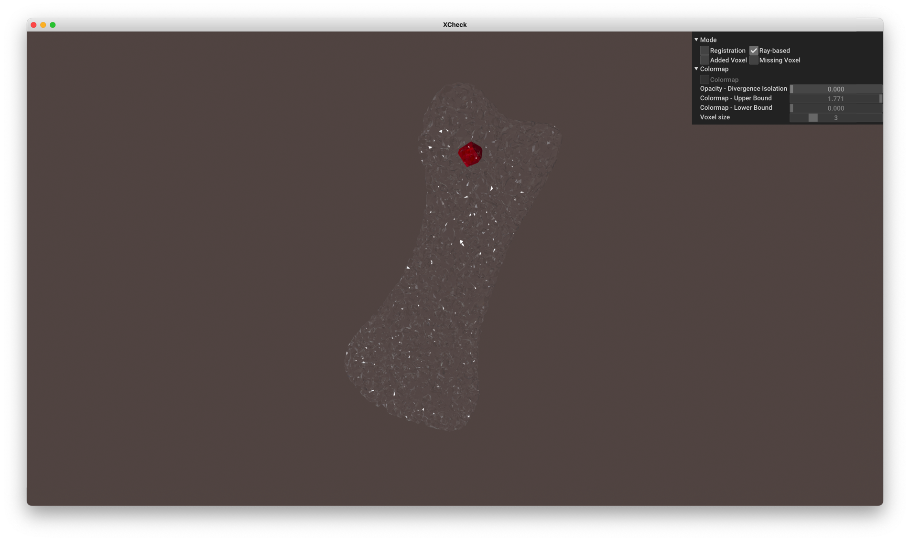
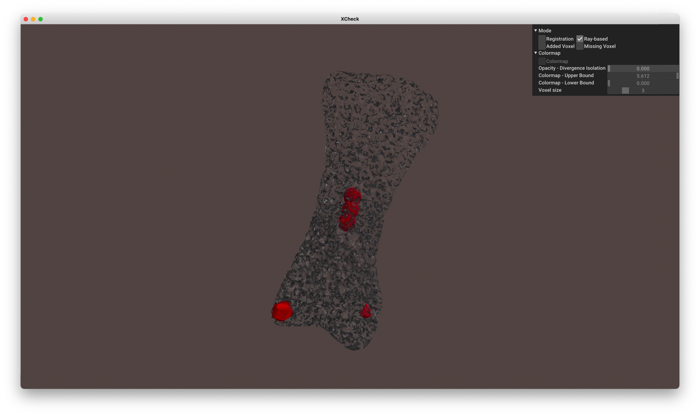
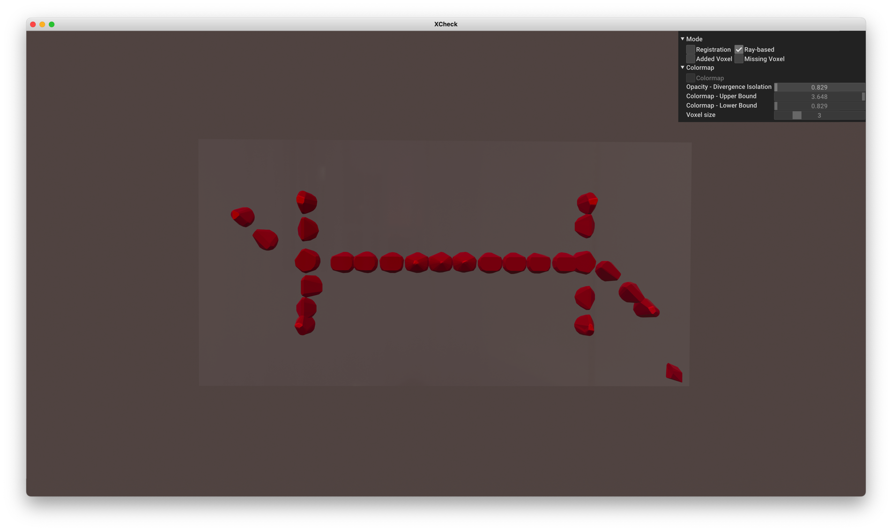
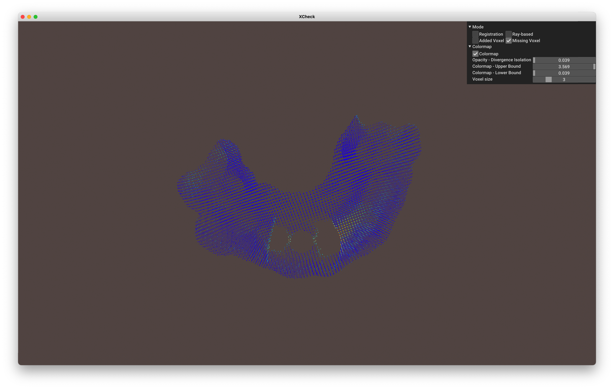
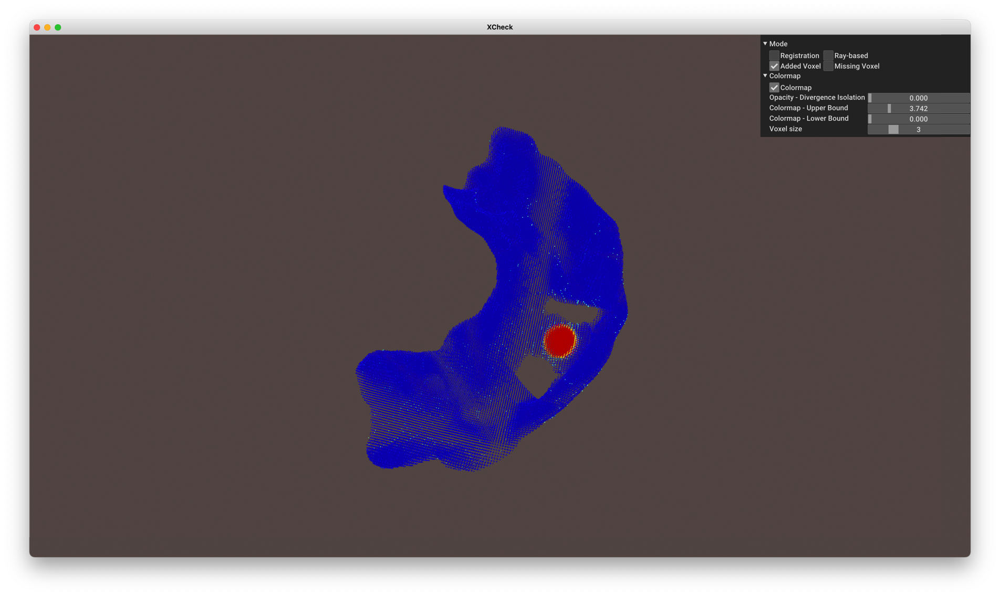
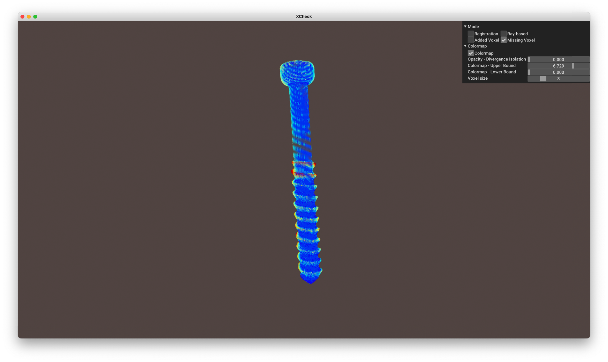
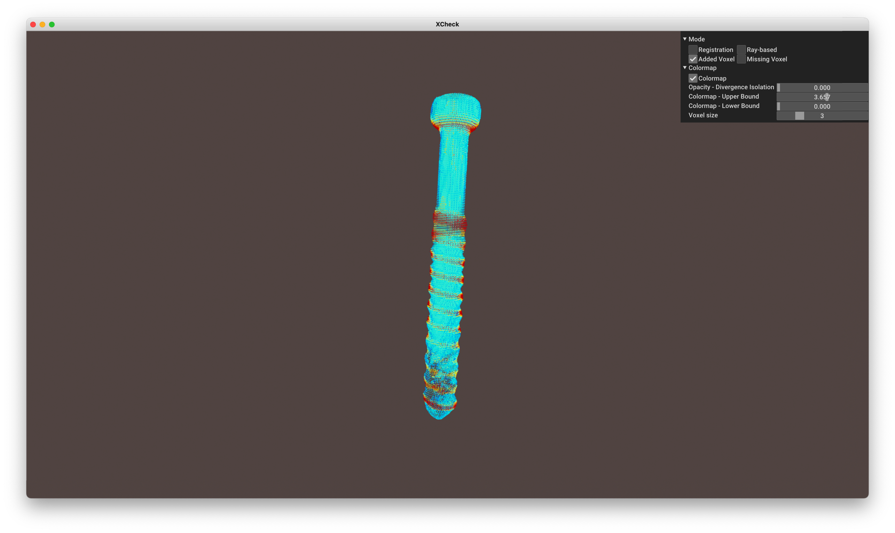
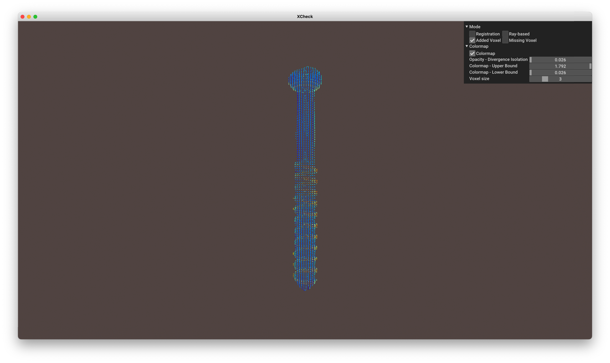

# XCheck - 3D Printed Patient-Specific Devices Verifier

This repository hosts the source code for paper "XCheck: Verifying Integrity of 3D Printed Patient-Specific Devices via Computing Tomography". The paper has been accepted by [32nd USENIX Security Symposium, 2023](https://www.usenix.org/conference/usenixsecurity23).

XCheck is a defense-in-depth approach that leverages medical imaging to verify the integerity of patient-specific devices (PSD) produced by medical printing. Different from side-channel based defenses, XCheck directly checks the computed tomography (CT) scan of the printed device to its original design. It verfies the geometry and material of the printed device with adapted geometry comparison techniques and statistical distribution analysis. To further enhance usability, XCheck also provides an adjustable visualization scheme and a quantitative risk score. Details regarding this work can be found in the [Sec'23 paper](https://www.usenix.org/system/files/sec23fall-prepub-483-yu-zhiyuan.pdf) and project website at [https://3dxcheck.github.io/](https://3dxcheck.github.io/) (in built).

## Dependencies
XCheck is implemented and tested on **Python 3.9** with 16GB of RAM. 
The following external packages are required: **vedo**, **matplotlib**, **numpy**, **scipy**, **point-cloud-utils**, **open3d**, **pydicom**, **seaborn**, and **vtkplotter**.
We recommend running XCheck in a virtual environment (e.g. conda) with at least of 16GB of RAM space. 

```bash
conda env create -f xcheck.yml 
```

XCheck is tested on machines with the following specs with OpenGL version of 4.1:

+ NVIDIA GeForce RTX 3070 Ti (8GB VRAM) + AMD Ryzen 9 3900X + 32GB RAM

+ AMD Radeon Pro 5500M (8GB VRAM) + Intel i9-9880H + 16GB RAM

# Usage

XCheck takes 2 volume objects in the form of a mesh (.stl, .obj, .ply, etc.), dicom series (folder containing .dcm files), or volume image (.tiff, .vti, .slc etc.), displaying a visual comparison based on voxel and ray-based analysis.

Invoke with the following arguments:

`-f1`: File path to object: Accepts volume image (.tiff, .vti, .slc etc...), directory containing Dicom series, or mesh objects (.stl, .obj, .ply etc...)

`-f2`: File path to object: Accepts volume image (.tiff, .vti, .slc etc...), directory containing Dicom series, or mesh objects (.stl, .obj, .ply etc...)

`-o`: Output name. XCheck automatically generates a directory under ./Results/ matching this name, checkpoints are stored here. 

`-etdist`: Provide a maximum error tolerance for distance

`-ets`: Provide a maximum error tolerance for delta scale.

`-etg`: Provide a maximum error tolerance for delta group.

`-etm`: Provide a maximum error tolerance for delta material.

`-t1`: Dual threshold values for feature extraction for input object. Ex: -200, 100, -500, 200

`-t2`: Dual threshold values for feature extraction for input object. Ex: -200, 100, -500, 200

`-basic`: Run basic tests, visualize results without running the entire system. Can be added after a command.


## Basic Tests
The basic tests are designed to be simple functionality checks that do not necessitate running the complete system, but instead verify that all required software components are functioning properly. In our repository, the basic tests utilize the intermediate results obtained from the prior experiments, to provide both visualization and final determination (i.e., malicious or benign) of the corresponding model. As such, these basic tests verify the proper functioning of XCheck while not having to go through intermediate processes such as model registration and Housdorff distance calculation.

To run an existing analysis in basic test mode, run the following command. please make sure the result subdirectory exist under the ./Results/ directory.
```
python3 run.py -basic <result_dir>
```
For example, the basic test for Bone_12 is:
```
python3 run.py -basic Bone_12
```

## Complete Execution 
To re-run the analysis in complete test mode, remove the `-basic` commands and enter the full command instead. Note that re-running analysis will overwrite the stored results of the respective model. 
```
python3 run.py -f1 <CT_scan_dir> -f2 <original_model_dir> -o <result_dir> -etdist <error_tolerance_distance> -ets <error_tolerance_scale> -etg <error_tolerance_group> -etm <error_tolerance_material>"
```

<!-- bone 12 -->
Compare CT scans of a 3D printed bone scaffold (manipulated by adding various internal solid regions) to its original model:
```
python3 run.py -f1 Geometry/Bone_12 -f2 Geometry/Bone.stl -o Bone_12 -etdist 1.7 -ets 0.05 -etg 0.005 -etm 1 
```


<!-- bone 14 -->
Compare CT scans of a 3D printed bone scaffold (manipulated by adding various internal solid regions) to its original model:
```
python3 run.py -f1 Geometry/Bone_14 -f2 Geometry/Bone.stl -o Bone_14 -etdist 1.7 -ets 0.05 -etg 0.005 -etm 1 
```


<!-- bone 24 solid region -->
Compare CT scans of a 3D printed bone scaffold (manipulated by adding various internal solid regions) to its original model:
```
python3 run.py -f1 Geometry/Bone_24 -f2 Geometry/Bone.stl -o Bone_24 -etdist 1.9 -ets 0.05 -etg 0.005 -etm 1 
```


<!-- chip 42 solid region -->
Compare CT scans of a 3D printed lung-on-chip (manipulated with solidified airways) to its original model:
```
python3 run.py -f1 Geometry/Chip_42 -f2 Geometry/Chip.stl -o Chip_42 -etdist 1.7 -ets 0.05 -etg 0.005 -etm 1
```


<!-- guide 2 -->
Compare CT scans of a 3D printed dental guide (swapped for a different material) to its original model:
```
python3 run.py -f1 Geometry/Guide_2 -f2 Geometry/Guide.stl -o Guide_2 -etdist 1.8 -ets 0.05 -etg 0.005 -etm 1
```


<!-- guide ball -->
Compare CT scans of another 3D printed dental guide (manipulated by adding a solid sphere) to its original model:
```
python3 run.py -f1 Geometry/Guide_ball.stl -f2 Geometry/Guide.stl -o Guide_ball -etdist 1.6 -ets 0.05 -etg 0.005 -etm 1 
```


<!-- screw short -->
Compare CT scans of a 3D printed bone screw (shorten the screw stem) to its original model:
```
python3 run.py -f1 Geometry/Screw_short -f2 Geometry/Screw.STL -o Screw_short -etdist 1.6 -ets 0.05 -etg 0.005 -etm 1
```


<!-- screw 5 -->
Compare CT scans of a 3D printed bone screw (significantly enlarged thread distance) to its original model:
```
python3 run.py -f1 Geometry/Screw_5/ -f2 Geometry/Screw.STL -o Screw_5 -etdist 1.6 -ets 0.05 -etg 0.005 -etm 1
```


<!-- screw material -->
Compare CT scans of a 3D printed bone screw (swapped for a different material) to its original model:
```
python3 run.py -f1 Geometry/C-Screw -f2 Geometry/Screw.STL -o C_screw -etdist 1.6 -ets 0.05 -etg 0.005 -etm 1
```

